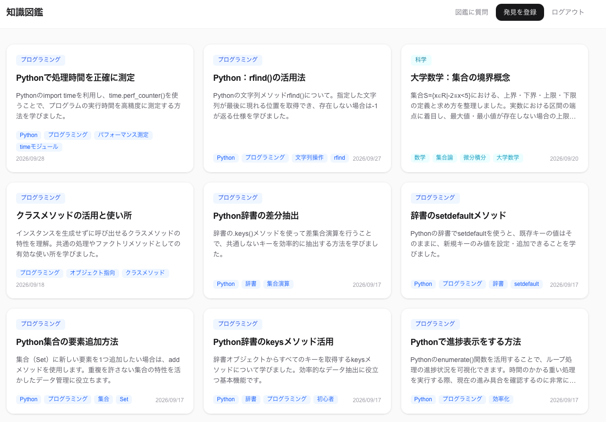
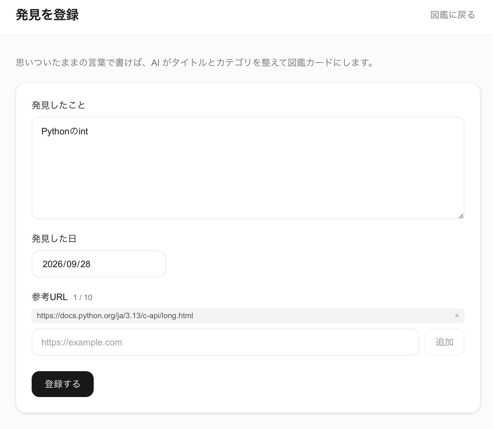
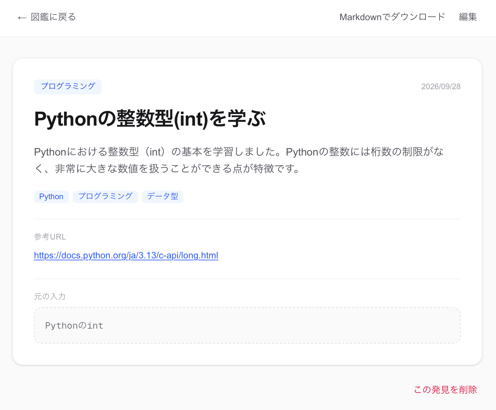
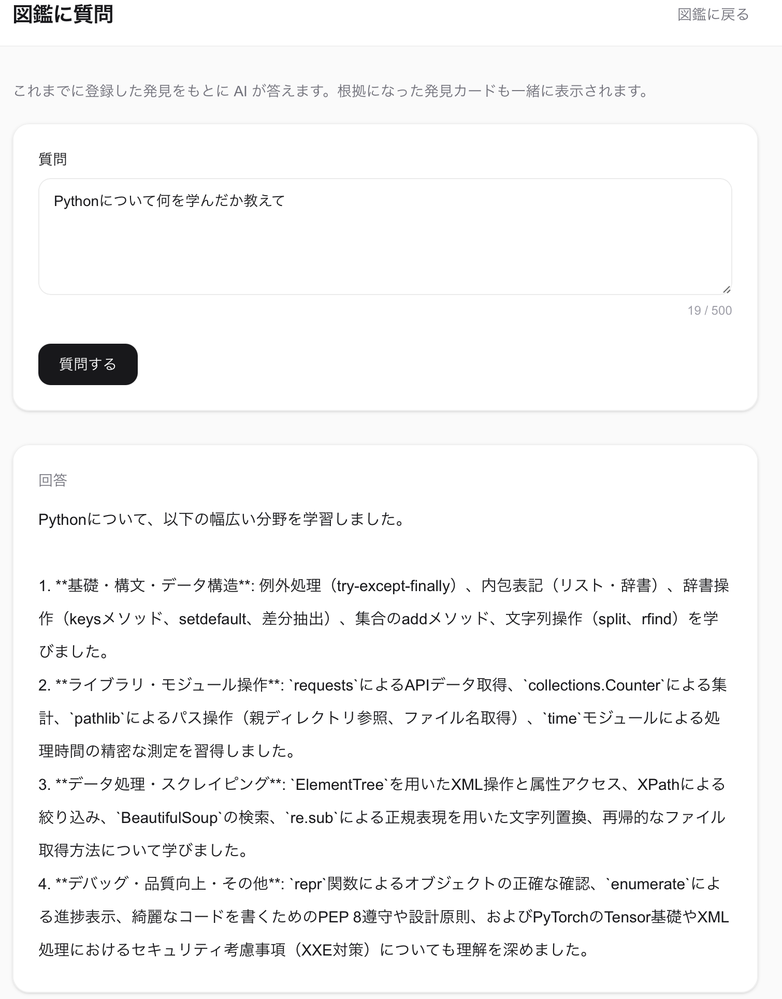
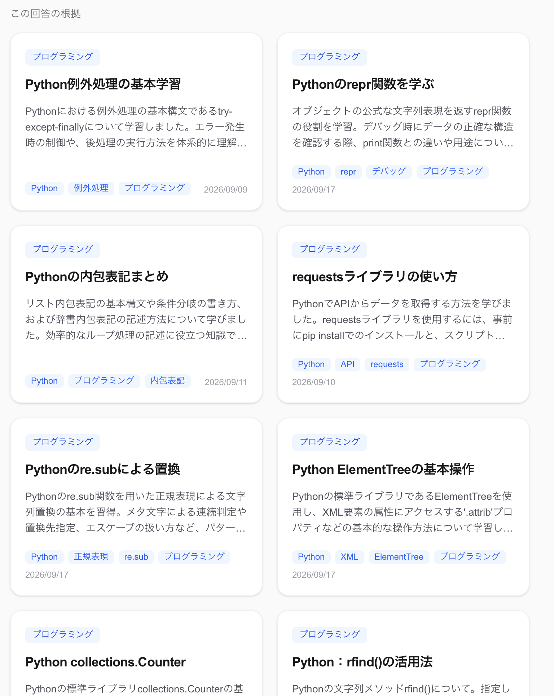
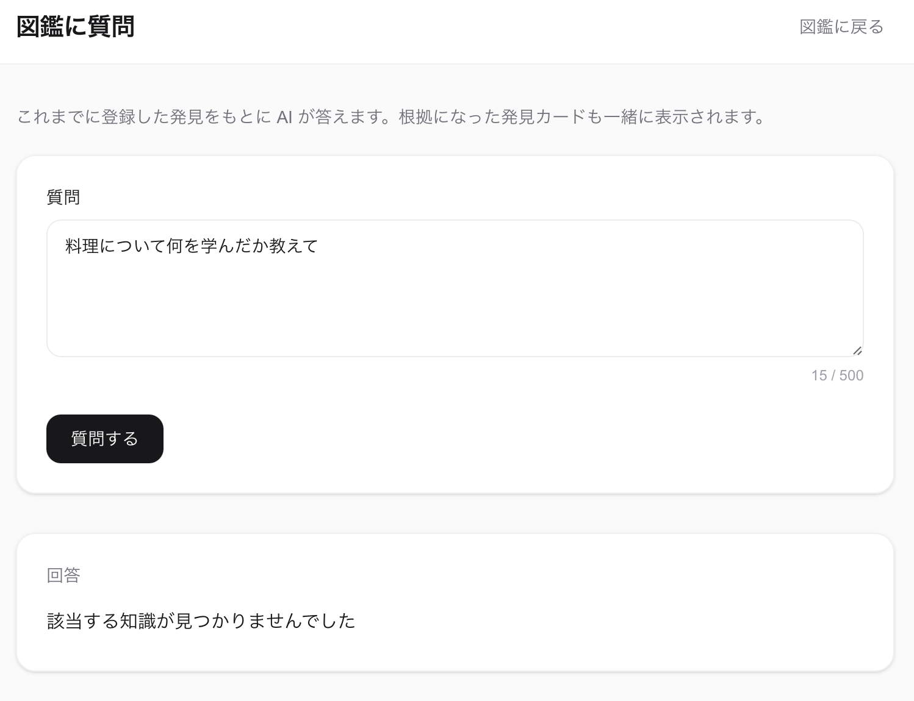

# 知識図鑑（knowledge_encyclopedia）

学んだことを一言メモのように入力すると、AI がタイトル・カテゴリ・要約・タグに整理し、
**図鑑カードとして蓄積していく個人用アプリ**です。
蓄積した自分の記録だけを根拠に、AI に質問することもできます。

- デモ: https://knowledge-encyclopedia-five.vercel.app
※ 下記「[既知の制約](#既知の制約)」を先にご確認ください
- 設計書: [docs/discovery-zukan-design.md](docs/discovery-zukan-design.md)（全31章。開発中の判断を ADR 形式で記録）

## スクリーンショット 
### 図鑑一覧

### 登録前後の比較


### 登録済みの質問


### 未登録の質問


---

## 主な機能

| 機能 | 内容 |
|---|---|
| 登録 | 1〜1000文字の原文、発見日、参考URL（最大10件）を入力。Gemini が title / category / summary / tags を生成する。カテゴリは8分類の固定リスト |
| 失敗時の保存 | LLM の出力が検証に通らない、または API 呼び出しに失敗した場合も、原文から作った値で保存する（原文を失わないことを優先） |
| 一覧・詳細・編集・削除 | 編集では LLM を再実行しない。原文（`raw_text`）は編集不可。編集後は検索用ベクトルを作り直す |
| 質問（RAG） | 1問1答。自分の記録だけを根拠に回答し、根拠にした記録を出典として表示する |
| エクスポート | 1件を Markdown、全件を zip で出力（OKF 形式）。インポートは未実装 |
| 認証 | Google ログインのみ。データはユーザーごとに分離 |

## 技術構成

| 層 | 使用技術 |
|---|---|
| フロントエンド | Next.js 16（App Router） / React 19 / TypeScript / Tailwind CSS 4 |
| バックエンド | FastAPI / SQLAlchemy / Alembic / Pydantic v2 / uvicorn |
| DB | Supabase（PostgreSQL + pgvector） |
| LLM | Gemini Interactions API（`gemini-3.1-flash-lite`） |
| 埋め込み | `gemini-embedding-001`（1536次元） |
| 認証 | Supabase Auth（Google ログイン）/ `@supabase/ssr` / PyJWT（ES256、JWKS でローカル検証） |
| ホスティング | Vercel（フロント） / Render（バックエンド）、いずれも無料枠 |

```
ブラウザ ──> Next.js（Vercel） ── /api/* を rewrites で転送 ──> FastAPI（Render） ──> Gemini API
             │  認証 Cookie は HttpOnly                          └──> Supabase PostgreSQL + pgvector
             └─ Supabase Auth（Google ログイン、PKCE）
```

LLM の呼び出し・出力の検証・DB への保存はすべて FastAPI 側で行い、
Next.js は表示に専念する役割分担にしています（[設計書 1章](docs/discovery-zukan-design.md#1-責務分担nextjs--fastapi)）。

---

## 設計上の判断

機能の数ではなく、以下の3点に時間を使いました。

### 1. RAG の捏造対策を多層で実装した

プロンプトで「記録だけを根拠に」と指示しても、守られるとは限りません。
そこでコード側に、結果が確定する機構を2つ置きました。
1つ目は、ベクトル検索（コサイン距離 0.35 未満）が0件なら **LLM を呼ばずに「該当なし」を返す**こと。一般知識で答える経路がなくなります。
2つ目は、LLM が返した出典 ID を検索結果と突き合わせ、**実在しない ID を除外する**こと。出典が0件になれば回答ごと破棄します。
ただし閾値は15件の検証データで決めた値です。回答本文は検証していないため、プロンプトインジェクション対策も途中です。

→ [16章 RAG実装の記録](docs/discovery-zukan-design.md#16-rag実装の記録完了分) /
[15章 閾値の決め方](docs/discovery-zukan-design.md#15-rag類似度の閾値をどう決めたか) /
[24章 プロンプトインジェクション](docs/discovery-zukan-design.md#24-%EF%B8%8F-ストアドプロンプトインジェクション現時点で存在するリスク)

### 2. コスト制御を設計の中心に置いた

LLM は呼ぶたびに料金が発生するため、呼び出し回数の管理を設計の中心に置きました。
当初は登録件数で判定していましたが、削除でカウントが戻る穴がありました。
そこで **呼ぶたびに1行追加し、削除経路を持たない `llm_calls` テーブル**に記録を移しました。
上限は3層です。許可リスト内はユーザーごとの日次、試用ユーザーはユーザーごとの累計と、試用側全体の日次です。
カウンターを分けたので、試用アカウントを大量に作られても許可リスト内の枠は減りません。
判定は `check_limit` に集約し、API を呼ぶ前に行います。試算上の最悪ケースは約38円/日です。

→ [14章 コスト制御](docs/discovery-zukan-design.md#14-%EF%B8%8F-llm呼び出しのコスト制御課金事故対策) /
[19章 コスト試算](docs/discovery-zukan-design.md#19-%EF%B8%8F-マルチユーザー化で必要になること) /
[29章 3層の上限](docs/discovery-zukan-design.md#-29-認証方式の選定adr)

### 3. 判断の過程をすべて記録した

開発中の判断は設計書に ADR 形式で残しています。採用した案だけでなく、却下した案とその理由も書いています。
たとえば認証は自前 JWT や Auth.js などと比較し、パスワードを保存しない Google ログインのみを選びました。
デプロイ先は Fly.io や Railway と比較し、クレジット切れで止まることのない Render を選びました。
誤りと分かった記述も消さずに訂正しています。
「予算アラートが最後の防波堤」は、通知するだけで支出を止めないと分かり訂正しました。
「rewrites で URL を隠す」は保護にならない、と脅威モデルに明記しています。

→ [29章 認証方式の選定](docs/discovery-zukan-design.md#-29-認証方式の選定adr) /
[30章 脅威モデル](docs/discovery-zukan-design.md#-30-脅威モデル) /
[31章 デプロイ先の選定](docs/discovery-zukan-design.md#-31-デプロイ先の選定adr) /
[28章 デプロイ前チェックリスト](docs/discovery-zukan-design.md#-28-デプロイ前チェックリスト統合版)

---

## 既知の制約

### 利用上の制約

- **初回アクセス時、起動に30〜60秒かかります。** バックエンドを Render の無料枠で動かしており、アクセスがないとスリープするためです。スリープ解除の ping は、月あたりの稼働時間上限と衝突するため行っていません（[31章](docs/discovery-zukan-design.md#-31-デプロイ先の選定adr)）。
- **Google の同意画面が「テスト」状態のため、ログインにはテストユーザーへの登録が必要です。** 本番公開にはロゴとドメインの登録が必要で、まだ対応していません（[29章](docs/discovery-zukan-design.md#-29-認証方式の選定adr)）。
- Supabase の無料プロジェクトは、7日間アクセスがないと一時停止します（[28章](docs/discovery-zukan-design.md#-28-デプロイ前チェックリスト統合版)）。
- 質問機能は1問1答です。会話形式や会話履歴の保存はありません。
- OKF はエクスポートのみで、インポートはできません。
- 類似度の閾値 0.35 は15件の検証データで決めた値です。件数が増えたら測り直す必要があります（[15章](docs/discovery-zukan-design.md#15-rag類似度の閾値をどう決めたか)）。

### 未実装の防御

[30章 脅威モデル](docs/discovery-zukan-design.md#-30-脅威モデル)で、守れていないものとして記録している項目です。

| 項目 | 現状 |
|---|---|
| レート制限 | 未導入。`llm_calls` の上限は累計量を守るが、短時間の連打は防げない |
| 不正アクセスの検知 | IP アドレスを記録していない |
| プロンプトの境界明示 | 未対応。回答本文の検証もしていない |
| Gemini API のクォータ | 設定値が未確認。アプリの外側で実際に止まる防波堤はこれになる |
| NUL バイトを含む入力 | 未対応（500 エラーになる） |
| Gmail の `+` エイリアス | 別アドレスとして扱うため、試用枠を複数取得できる。試用側の全体日次上限で総額は抑えている |
| 開発用 DB の分離 | 開発と本番が同じ Supabase プロジェクト |
| Supabase の Redirect URLs | ワイルドカード指定のまま |

### テスト

自動テストはありません。動作確認は Swagger UI とブラウザで手動で行っています。
他ユーザーのデータが見えないこと（一覧・詳細・編集・削除・質問・zip・Markdown の7経路）は、
別の Google アカウントでログインして、ローカルと本番の両方で確認しました（[30章 E節](docs/discovery-zukan-design.md#-30-脅威モデル)）。

---

## ローカルでの起動

### 前提

- Python 3.11 以上（`enum.StrEnum` を使用）
- Node.js 20.9 以上（Next.js 16 の要件）
- Supabase プロジェクト（PostgreSQL と Auth を使用）
  - `vector` 拡張（pgvector）を有効にしておく。マイグレーションでは作成しません
  - Auth で Google プロバイダを有効にし、リダイレクト先に `http://localhost:3000/auth/callback` を登録する
- Gemini API キー

> 本番と同じ Supabase プロジェクトにつなぐと、ローカルでの操作がすべて本番データに書き込まれます。

### バックエンド

```bash
cd backend            # リポジトリのルートで起動すると ModuleNotFoundError になる
python -m venv .venv
source .venv/bin/activate
pip install -r requirements.txt
cp .env.example .env  # 値を設定する（下表）
alembic upgrade head
uvicorn app.main:app --reload
```

`http://localhost:8000/health` が `{"status":"ok"}` を返せば起動しています。

| 環境変数 | 内容 |
|---|---|
| `DATABASE_URL` | Supabase の Session pooler の接続文字列。接頭辞を `postgresql+psycopg://` にする |
| `GEMINI_API_KEY` | Gemini API キー |
| `LLM_MODEL` / `EMBEDDING_MODEL` | 使用するモデル名 |
| `SUPABASE_URL` | Supabase プロジェクトの URL（JWKS の取得に使う） |
| `ALLOWED_EMAILS` | 許可リスト（カンマ区切り）。リスト外は試用ユーザー扱い |
| `VECTOR_THRESHOLD` | 任意。類似度の閾値（既定 0.35） |
| `DAILY_*` / `TRIAL_*` | 任意。3層の上限値（既定値は `app/config.py`） |

### フロントエンド

```bash
cd frontend
npm install
cp .env.example .env.local  # 値を設定する（下表）
npm run dev
```

`http://localhost:3000` を開くとログイン画面が表示されます。

| 環境変数 | 内容 |
|---|---|
| `INTERNAL_API_BASE_URL` | FastAPI の URL（ローカルなら `http://localhost:8000`）。本番の URL を残したままにしない |
| `NEXT_PUBLIC_SUPABASE_URL` | Supabase プロジェクトの URL |
| `NEXT_PUBLIC_SUPABASE_ANON_KEY` | Supabase の anon キー |

---

## 今後の展望

設計書に「未実装」として記録している項目のうち、優先度の高いものです。

- レート制限（slowapi）とプロンプトの境界明示
- 他ユーザーのデータが見えないことの確認を、手動から自動テストへ
- 独自ドメインを取得し、Google 同意画面を本番公開
- 質問機能を会話形式にし、会話履歴を保存する（[20章](docs/discovery-zukan-design.md#20-会話形式にする際の設計論点)）
- OKF インポート（[27章](docs/discovery-zukan-design.md#27-okfインポート未実装後日)）
- 上限に達したとき、質問を LLM を使わない全文検索に切り替えて「関連する記録」までは返す（[29章](docs/discovery-zukan-design.md#-29-認証方式の選定adr)）

### 使用してみた感想
- 動作一つ一つに時間がかかるので、速度を上げたい
- 登録してある日付の場所を統一したい
- 既存のカテゴリでは分類しきれていない(数学の発見を入れた際は、数学にいれたい等)
- 私はnotionを普段使いしているため、notinoに書いた内容を知識づかんに再度追加する手間がかかってしまう

### 使用してもらったユーザーからの声
- スマホで使うと、戻るを連打したらログアウトを押してしまう。
- 自分が持っているスキルを視覚化したい（足りてない領域を把握できる）
- 他のユーザーが登録しているトレンドのスキルを見れたら嬉しい(直近１ヶ月で多く学習されたものとか)
- 図鑑に質問する時に、画面遷移せずに質問できたら嬉しい
- タグで検索する機能、フリーテキスト検索が欲しい
など多数のお声をいただきました。